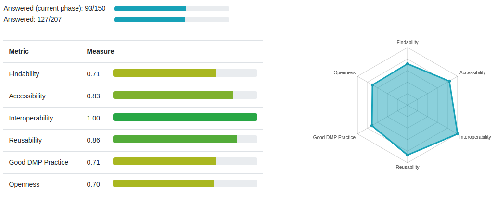

# Data management plan for the POLARFRONT project

Author: [Conrad Helgeland](mailto:che@akvaplan.niva.no) (project data manager)
Latest draft: [dmp.md](https://github.com/akvaplan-niva/polarfront/blob/main/dmp.md)
Previous version: [v0](https://github.com/akvaplan-niva/polarfront/blob/v0/dmp.md) (2021-08-22)
Stage: Contract phase

## Project

Title: "Polar Front ecosystem studies using novel autonomous technologies"
Code: POLARFRONT
Start: 2021-11
End: 2024-12

Science partners:

- [Akvaplan-niva](https://akvaplan.niva.no) (project leader)
- [UiT](https://uit.no) – The Arctic University of Norway
- [Norwegian Polar Institute](https://npolar.no)
- [Scottish Association for Marine Science](https://sams.ac.uk)
- [Memorial University](https://mun.ca)
- [Institute of Oceanology – Polish Academy of Science](https://iopan.gda.pl)

Industry partners:

- [Equinor](https://equinor.com/)
- [ConocoPhillips](https://www.conocophillips.com)

Public funding:

- [Research Council of Norway](https://forskningsradet.no), grant 326635

Data repositories:

- [DataverseNO](https://dataverse.no) – primary data storage
- [Zenodo](https://dataverse.no) – for posters, presentations, and other material

Data management source code and issue tracker:

- https://github.com/akvaplan-niva/polarfront

## Principles (data policy)

The FAIR principles of findable, accessible, interoperable, and reusable data has gained widespread traction and is now incorparated as requirements for public funding across the globe, including in Research Council of Norway's [policy for open access to research data][1].

A tension exist between producing standardised/quality controlled data vs. early publishing of raw and unprocessed data. In POLARFRONT, we avoid this tension by following open science principles and publishing raw data as early as possible. [No raw data, no science][2].

Open science has many facets beyond open data, it implies "[extending the principle s of openness to the whole research cycle][3]".

Whenever feasible, we will perform data analysis using automated and repeatable processing pipelines. All software developed to collect, process, analyse, and visualise data will be published as open source.

In order to ensure discoverability, citability, integrity, and long term preservation, we will publish data in [TRUST]-worthy repositories thtat supports persistent identifiers (DOIs) and versioning.

All scientific articles from the project will be open access.

## Data collection

Data collection is spread over 3 scientific cruises with R/V [Helmer Hanssen](https://en.uit.no/infrastruktur/enhet?p_document_id=696494), operated by the [University of Tromsø](https://uit.no).

Each cruise will collect data using

- Autonomous vehicles (from the Akvaplan-niva glider fleet)
- Ship-based sampling (by onboard equipment)
- Ship-based station sampling and measurements

For details on scientific parameters and equipment, refer to the POLARFRONT project proposal.

## Data management tooling

Elixir Norway's Data Stewardship Wizard is used to develop the present [data management plan](https://elixir-no.ds-wizard.org/projects/873c2b7c-3baf-4c5f-ae24-75b8d7bf4e02).

The wizard features FAIRness metrics used for measuring compliance with the FAIR guidelines.

## Data storage

Prior to permanent archiving, special arrangements are needed to secure data and make it available for data processing and analysis.

UiT is Responsible for securing data from onboard equipment.

For station based sampling, storing data and samples must be handled by the team behind each group or type of sampling.

Autonomous vehicle data will be handled by Akvaplan-niva and stored in Microsoft Azure in cooperation with Kongsberg Maritime.

## Data archive

POLARFRONT has reached an agreement of free permanent data archiving in [DataverseNO](https://dataverse.no/), operated by the University of Tromsø. DataverseNO is a [CoreTrustSeal](https://coretrustseal.org) certified data publisher, running an instance of the open source research data repository software [dataverse](https://github.com/IQSS/dataverse).

## Data catalog

A data catalog is planned in the DCAT vocabulary linking to all raw data, and derived data products.

## Data processing pipelines

Data publishing in POLARFRONT is led by a dedicated data manager, that will develop a suite of routines for automated data production and publishing. Automating data publishing enables consistent high quality data, that pass automated quality control and standardisation, and enables data provenance and tracability.

Raw data will be deposited as soon as possible after capture allowing it to work as input for further analysis and processing.

We will strive to make POLARFRONT data easy to use and interoperable relying on non-proprietary preservation formats.

Specific data processing pipelines will be developed for each of the three groups mentioned in Data collection above.
In addition, pipelines will be created to produce sampling event metadata for station based work, biodiversity data, and for model input data.

The data processing pipelines will be published as open source under [Akvaplan-niva's GitHub](https://github.com/akvaplan-niva).

## Data visualisation

Autonomous platforms will be integrated into the Kognifai digital platform (Kongsberg Maritime) for real-time data
streaming, cloud processing, and visualization for scientists and other users.

Oceanography data captured by gliders will be plotted in near real-time, using 3D WebGL rendering, in a web application developed by Akvaplan-niva.

## Data paper

A data paper is planned on the data management approach and key datasets from the POLARFRONT project.

## Open issues

The following needs to be clarified before first data is published:

- Exact dataset licencing and criteria (CC-BY vs. public domain dedication)
- Who (people or institutions) should be listed as author if auttribution licensing is choosen?
- Embargo period and crieria
- Data partitioning strategy, for raw data
- Data versioning strategy

[1]: https://www.forskningsradet.no/en/Adviser-research-policy/open-science/open-access-to-research-data/
[2]: https://doi.org/10.1186/s13041-020-0552-2
[3]: https://www.fosteropenscience.eu/content/what-open-science-introduction
[dwbp]: https://www.w3.org/TR/dwbp/
[fair]: https://doi.org/10.1038/sdata.2016.18
[trust]: https://doi.org/10.1038/s41597-020-0486-7
[unesco-transform]: https://en.unesco.org/sites/default/files/codata_open_science_for_a_global_transformation.pdf
