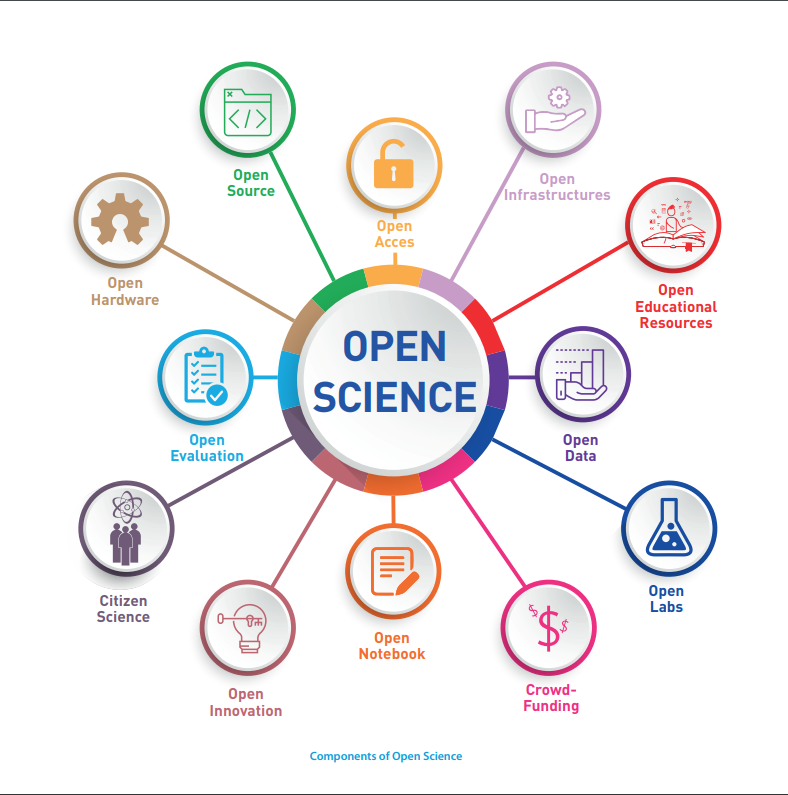

# Data management plan for the POLARFRONT project

Author: [Conrad Helgeland](mailto:che@akvaplan.niva.no)
Version: 2021-08-DRAFT
Stage: Contract phase

## Project

Title: "Polar Front ecosystem studies using novel autonomous technologies"
Code: POLARFRONT
Start: 2021-11
End: 2024-12
Funding: [Research Council of Norway][rcn], grant 326635.

## Principles

POLARFRONT data mangement is based on the [transformational idea of open science][unesco-transform], the [FAIR] guidelines, and the [W3C] recommandation [Data on the Web Best Practices][dwbp].

The FAIR principles of findable, accessible, interoperable, and reusable data has gained widespread traction and is now incorparated as requirements for public funding across the globe, including in Research Council of Norway's [policy for open access to research data][2].

Open science, "[extending the principles of openness to the whole research cycle][1]", has many facets.
POLARFRONT open data, open source, open access, and open infrastructues.

_[Towards a UNESCO Recommendation on Open Science][unesco-brochure]_

## References

[1]: https://www.fosteropenscience.eu/content/what-open-science-introduction
[2]: https://www.forskningsradet.no/en/Adviser-research-policy/open-science/open-access-to-research-data/
[dwbp]: https://www.w3.org/TR/dwbp/
[fair]: https://doi.org/10.1038/sdata.2016.18
[miyakawa 2020]: https://doi.org/10.1186/s13041-020-0552-2
[rcn]: https://www.forskningsradet.no
[trust]: https://doi.org/10.1038/s41597-020-0486-7
[unesco-transform]: https://en.unesco.org/sites/default/files/codata_open_science_for_a_global_transformation.pdf
[unesco-brochure]: https://en.unesco.org/sites/default/files/open_science_brochure_en.pdf
[w3c]: https://w3.org
