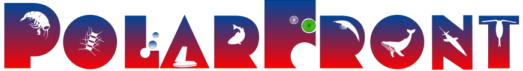

# PolarFront data management

Open science project, led by [Akvaplan-niva](https://www.akvaplan.niva.no/)

Official name: _Polar Front ecosystem studies using novel autonomous technologies: Knowledge for environmental management and assessing ecological risk_

## Data repositories

- Raw & analysed data: [DataverseNO](https://dataverse.no/dataverse/polarfront)
- Data management: [GitHub](https://github.com/akvaplan-niva/polarfront)
- Other: [Zenodo](https://zenodo.org/communities/polarfront)

## Open science statement

(From _Project proposal_, 2021):

> Open science informed by best practices.
> We will manage POLARFRONT data in accordance with FAIR principles and the W3C best practices for publishing data on the web.
> POLARFRONT will be built on open science principles, in line with The Research Council of Norway’s recent policy on open science and the open data policies of UiT and Akvaplan-niva.

## Data management plan (DMP)

- [working draft](https://elixir-no.ds-wizard.org/projects/873c2b7c-3baf-4c5f-ae24-75b8d7bf4e02) on ELIXIR-Norway Data Stewardship Wizard
- [pre-contract](https://github.com/akvaplan-niva/polarfront/blob/38f363e5aefd6183716624984c91ae55f6865bd1/dmp.md) (v0)

## Partner institutions

- [Akvaplan-niva](https://akvaplan.niva.no) (project leader)
- [ConocoPhillips](https://www.conocophillips.com)
- [Equinor](https://equinor.com/)
- [Institute of Oceanology – Polish Academy of Science](https://iopan.gda.pl)
- [Memorial University](https://mun.ca)
- [Norwegian Polar Institute](https://npolar.no)
- [Scottish Association for Marine Science](https://sams.ac.uk)
- [UiT](https://uit.no) – The Arctic University of Norway

Public funding: [Research Council of Norway](https://forskningsradet.no), grant 326635

## Links

- [PolarFront @ Akvaplan-niva](https://www.akvaplan.niva.no/en/projects-networks/polar-front-ecology/)
- [PolarFront in Cristin](https://app.cristin.no/projects/show.jsf?id=2524794)
- [PolarFront in Research Council of Norway's project bank](https://prosjektbanken.forskningsradet.no/en/project/FORISS/326635)
